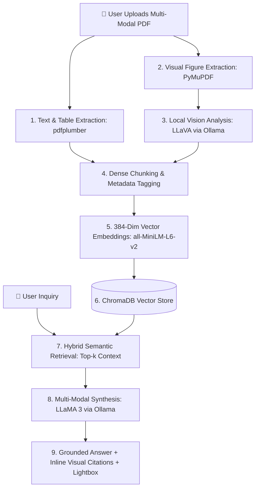

# 👁️ SpectraModal AI: Multi-Modal PDF RAG Agent

> **A 100% local, privacy-first Multi-Modal Retrieval-Augmented Generation (RAG) assistant that extracts, indexes, and reasons across Narrative Text, Structured Data Tables, and Visual Charts/Figures using local Vision AI.**

---

## 💡 The Core Problem: Why Standard RAG Fails on Visual Documents

Most real-world PDF reports (annual reports, scientific papers, financial decks) store their most critical insights inside **charts, plots, and architecture diagrams**, not just plain text.

* **Traditional RAG is blind:** Standard PDF parsers discard visual images completely or treat them as blank space.
* **SpectraModal Solution:** Extracts embedded images via **PyMuPDF**, sends figures to a local **LLaVA Vision AI** model to translate visual trends, axes, and legends into detailed descriptive text, parses tables with **pdfplumber**, and indexes everything together in **ChromaDB**.

---

## 🏗️ Architecture & Workflow



---

## ✨ Key Features

1. **Multi-Modal Tri-Stream Ingestion:**
   - **Text:** Extracted page-by-page.
   - **Tables:** Parsed into Markdown pipe matrices (`Metric | 2024 | 2025`).
   - **Visuals:** Extracted charts analyzed by local LLaVA vision model for trends and metrics.
2. **Visual Citation Lightbox:**
   - Cites exact page numbers and displays inline thumbnails of referenced figures.
   - Click any thumbnail to view the full-resolution chart in an interactive **Lightbox Modal** alongside LLaVA's analysis.
3. **Extracted Figures Gallery:**
   - Live sidebar gallery of all diagrams found in the document with one-click *"Ask about this chart"* shortcuts.
4. **Interactive Glassmorphic Interface:**
   - Dark cyber-minimalist UI with smooth micro-animations.
   - Formatted Markdown rendering (tables, code snippets, lists).
   - **Text-to-Speech (TTS)** audio narration for answers.
   - **Export Report:** One-click download of conversation and citations as Markdown.
5. **Zero Cloud Dependencies:**
   - Runs completely offline on local hardware with zero API keys or recurring costs.

---

## 🛠️ Tech Stack

* **Backend:** FastAPI, Uvicorn, LangChain, PyMuPDF, pdfplumber
* **Local AI Models:** 
  * **LLaVA** (Vision Model via Ollama)
  * **LLaMA 3** (Language Model via Ollama)
  * **all-MiniLM-L6-v2** (Dense Embeddings via HuggingFace/Sentence-Transformers)
* **Vector Store:** ChromaDB (in-memory)
* **Frontend:** Modern Vanilla HTML5 / CSS3 (Glassmorphism), JavaScript, marked.js

---

## 🚀 Quick Start

### 1. Prerequisites
Ensure [Ollama](https://ollama.com/) is installed and the required models are pulled:
```bash
ollama pull llama3
ollama pull llava
```

### 2. Install Dependencies
```bash
pip install -r requirements.txt
```

### 3. Launch Application
```bash
python app.py
```

Open your browser and navigate to:
```
http://127.0.0.1:8002
```

---

## 📖 How to Use

1. **Upload a PDF:** Drag and drop any multi-modal PDF (e.g. financial 10-K, technical whitepaper) into the left upload zone.
2. **Explore Extracted Figures:** Review the extracted charts and visual figures automatically populated in the sidebar gallery.
3. **Ask Questions:**
   - Ask about visual charts: *"What trend is shown in the chart on page 33?"*
   - Ask about tables: *"Summarize the revenue breakdown across 2024 and 2025."*
   - Use quick starter chips: *"📊 Chart Summary"*, *"📈 Key Metrics"*, or *"🎯 Executive Summary"*.
4. **Inspect Sources:** Click any inline figure citation to inspect the original visual chart in the Lightbox modal.
